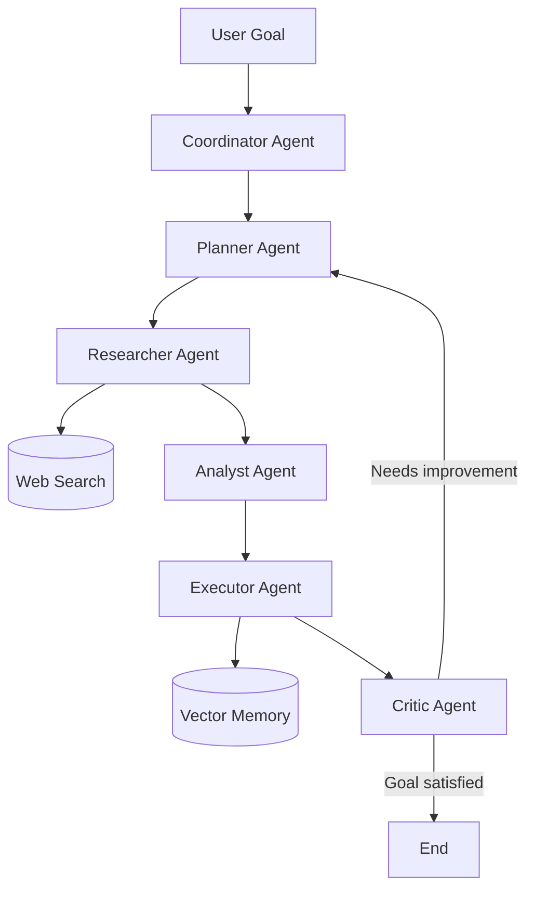
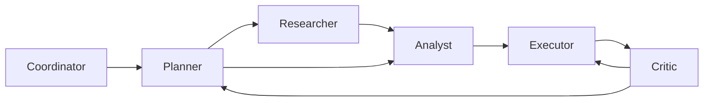
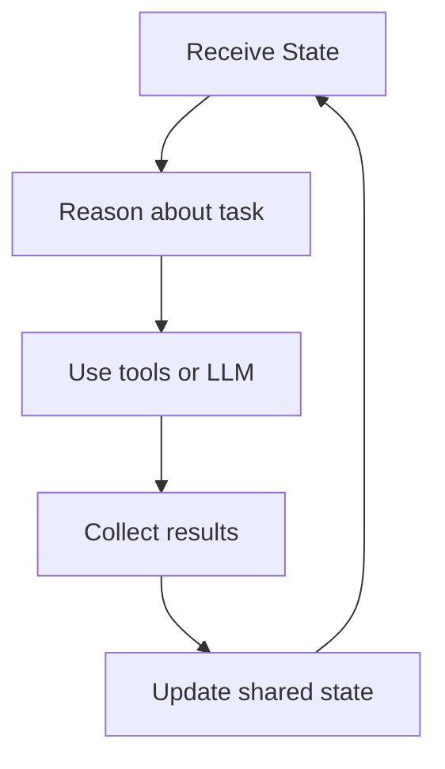
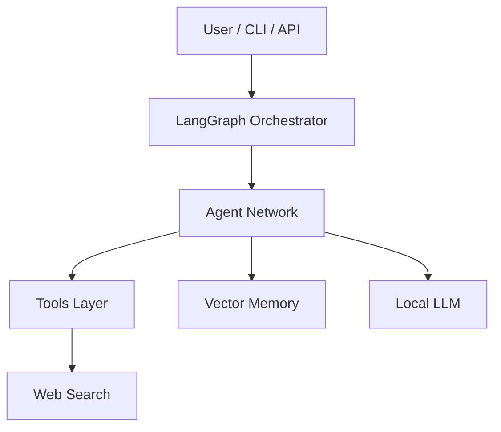

# Agent System Advanced — Distributed Multi-Agent System (Local LLM)

A local **multi-agent AI system** featuring recursive planning, task delegation, web search, and long-term memory, designed to run locally on a laptop using a local LLM.

This project demonstrates a modern **agentic architecture** using a properly structured Python package and only has an educational goal.


---

# Features

- Multi-agent architecture (Coordinator / Planner / Researcher / Executor  / Analyst / Critic)
- Recursive task planning
- Agent-to-agent delegation
- Web search integration
- Long-term vector memory (Chroma)
* Evaluation and refinement loops
- Fully local LLM via Ollama
* Extensible architecture for distributed agents
- Clean Python package structure
- CLI entrypoint via `uv`


---
# Overview


The system organizes several specialized agents that collaborate to solve complex goals.

Each agent performs a focused role in the workflow and shares state with the others.

Agents implemented:

| Agent       | Role                                          |
| ----------- | --------------------------------------------- |
| Coordinator | routes tasks and selects next agent           |
| Planner     | decomposes goals into actionable tasks        |
| Researcher  | collects information from the web             |
| Analyst     | extracts insights from gathered data          |
| Executor    | produces the final output                     |
| Critic      | evaluates the result and triggers improvement |

  

---

  

# Architecture

  



  

---

  

# Agent Interaction Graph

  

This diagram shows **how agents communicate and delegate tasks**.

  



  

Key interaction patterns:

* Planner decomposes complex goals
* Researcher gathers data
* Analyst extracts meaning
* Executor generates final outputs
* Critic ensures quality and may restart planning

---

# Internal Agent Loop

Each agent follows a typical **reasoning cycle**.



This loop enables **iterative improvement and autonomy**.


---

# Technical Architecture

This diagram shows the system layers.



  

---

# Technology Stack

Core frameworks:

* LangGraph — agent workflow orchestration
* LangChain — tool abstractions and LLM interfaces

Local AI models:

* Ollama
* Llama3 (or any compatible model)

Tools:
* DuckDuckGo search
* Chroma vector database

Environment management:
* uv (fast Python package manager) 

---

# Project Structure

```
agent-system-advanced/
│
├── agent_system/              # Python package
│   ├── __init__.py
│   ├── main.py               # Entry point of the application
│   ├── graph.py              # LangGraph multi-agent workflow
│   ├── state.py              # Shared state passed between agents
│   │
│   ├── agents/               # Contains each specialized agent
│   │   ├── coordinator.py
│   │   ├── planner.py
│   │   ├── analyst.py
│   │   ├── researcher.py
│   │   ├── executor.py
│   │   └── critic.py
│   │
│   ├── memory/               # Vector memory implementation
│   │   └── vector_memory.py
│   │
│   └── tools/                # External tools used by agents 
│       └── web_search.py
│
├── pyproject.toml
├── uv.lock
└── README.md
```


  

---

# Requirements

- Python >= 3.12
- Ollama installed
- uv package manager
---

# Installation

## 1. Install uv

```
curl -LsSf https://astral.sh/uv/install.sh | sh
```

## 2. Clone the repository

```
git clone https://github.com/AlexChariot/agent-system-advanced.git
cd agent-system-advanced
```

---

## 3. Install dependencies

```
uv sync
```

Optional (dev tools):

```
uv sync --group dev
```
---

# Install the Local LLM

## Install Ollama

```
curl -fsSL https://ollama.com/install.sh | sh
```

## Pull a model

```
ollama pull llama3
```

## Start Ollama

```
ollama serve
```


---

# Running the System

Run the multi-agent application

## Run via CLI entrypoint

```
uv run agent
```

## Alternative (direct execution)

```
uv run python -m agent_system.main
```

---


# Example
```

Goal:

Analyze the impact of open-source LLMs

```

  

The system will automatically:

1. Create a task plan
2. Perform research
3. Analyze collected data
4. Produce a result
5. Evaluate quality
6. Iterate if needed

---
  
# Key Design Choice: Python Package

This project is structured as a proper Python package:
- All imports are **absolute** (`agent_system.*`) 
- CLI is exposed via `project.scripts`
- Compatible with `uv` packaging system

This ensures:
- reliable execution (`uv run agent`)
- maintainability
- scalability
- clean dependency resolution  

---

# Long-Term Memory

The system uses **Chroma** as a vector database.

- Stores task outputs
    
- Retrieves relevant past knowledge
    
- Enables cross-session reasoning

---

# Development Tips

Run checks (very useful)

```
uv run python -c "import agent_system"
```

Lint (optional):

```
uv run ruff check .
```

---

# Troubleshooting

## ModuleNotFoundError

Ensure:

- `agent_system/__init__.py` exists
- imports use absolute paths:
```
from agent_system.module import ...
```

- environment is rebuilt:
```
uv sync --reinstall
```
---


# Example Workflow
  
```
User Goal
↓
Planner creates tasks
↓
Researcher collects information
↓
Analyst extracts insights
↓
Executor produces output
↓
Critic evaluates result
↓
Loop if improvements needed
```
  

---
  

# Future Improvements

  

Possible next steps:

- Autonomous browser agent
- Task hierarchy & decomposition tree
- Multi-agent collaboration (A2A style)
- Distributed agents execution
- Agents running in separate processes or machines using:
	* gRPC
	* message queues
	* Redis streams
- Agents dynamically bid on tasks
- Tool discovery
- Integrate Model Context Protocol (MCP)
- Parallel research agents
- Multiple researchers working simultaneously
- Browser automation
- Agents capable of browsing websites
  

---

# Educational Goal

This repository is intended as a **learning platform for modern agent architectures**.
  
It can be extended to build:
  
* autonomous research agents
* distributed AI systems
* agent societies
* coding assistants
* intelligent automation platforms
  
---
  
# Inspiration
  
Architectures similar to this are being explored in modern agent research and industrial AI systems.
  
The concepts demonstrated here represent the foundation of **next-generation autonomous AI workflows**.

