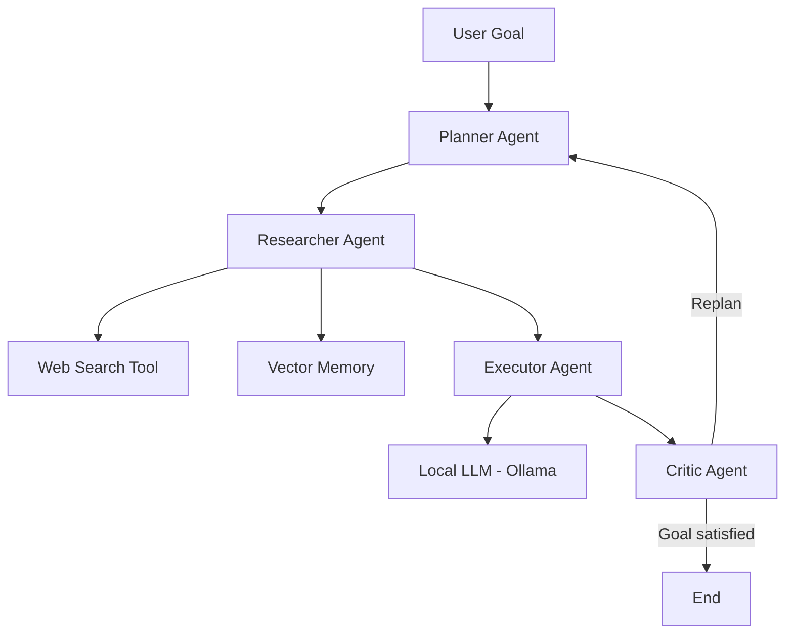

# Agent System Advanced

A local **multi-agent AI system** featuring recursive planning, task delegation, web search, and long-term memory.

This project demonstrates a modern **agentic architecture** built with:

* LangGraph for agent orchestration
* LangChain components
* Ollama for running local LLMs
* Chroma for long-term vector memory
* DuckDuckGo for web search
* uv for Python dependency management

The entire system runs **locally on a laptop**.

---

# Features

* Multi-agent architecture
* Recursive task planning
* Agent-to-agent delegation
* Web search capability
* Long-term vector memory
* Autonomous agent loop
* Local LLM execution
* Modular architecture

---

# Architecture

The system is composed of four main agents:

Planner → Researcher → Executor → Critic

Workflow:

1. **Planner**

   * Breaks the user goal into actionable tasks.

2. **Researcher**

   * Retrieves relevant information from:

     * web search
     * long-term vector memory

3. **Executor**

   * Executes the current task using the LLM.

4. **Critic**

   * Evaluates whether the goal has been achieved.
   * If not, the system re-plans and continues.

The process repeats until the objective is satisfied.

---

# Project Structure

```
agent-system-advanced
│
├── main.py
├── graph.py
├── state.py
│
├── agents/
│   ├── planner.py
│   ├── researcher.py
│   ├── executor.py
│   └── critic.py
│
├── memory/
│   ├── vector_memory.py
│
├── tools/
│   └── web_search.py
│
└── pyproject.toml
```

---

# Requirements

* Python 3.10+
* Ollama installed
* uv package manager

---

# Installation

## 1. Install uv

```
curl -LsSf https://astral.sh/uv/install.sh | sh
```

## 2. Clone the repository

```
git clone https://github.com/yourusername/agent-system-advanced.git
cd agent-system-advanced
```

## 3. Install dependencies

```
uv sync
```

Or manually add them:

```
uv add langgraph
uv add langchain
uv add langchain-community
uv add chromadb
uv add duckduckgo-search
uv add pydantic
```

---

# Install the Local LLM

Install Ollama:

```
curl -fsSL https://ollama.com/install.sh | sh
```

Download the model:

```
ollama pull llama3
```

Start the Ollama server:

```
ollama serve
```

---

# Running the System

Run the main program:

```
uv run python main.py
```

Example interaction:

```
Goal:
Write a report on open-source LLM trends
```

The system will automatically:

1. Plan tasks
2. Perform web research
3. Execute subtasks
4. Evaluate results
5. Repeat if necessary

---

# System Architecture




# Agent Workflow

```
User Goal
   │
   ▼
Planner
   │
   ▼
Researcher
   │
   ├── Web Search
   └── Vector Memory
   │
   ▼
Executor
   │
   ▼
Critic
   │
   ├── Goal satisfied → END
   └── Otherwise → Re-plan
```

---

# Long-Term Memory

The system uses **Chroma** as a vector database.

Each completed task result is stored in memory and can be retrieved later through semantic search.

This allows the agent to accumulate knowledge across executions.

---

# Example Use Cases

* Autonomous research agents
* AI assistants with memory
* Experimentation with agentic architectures
* Local AI systems without external APIs
* Multi-agent workflow experimentation

---

# Future Improvements

Potential extensions:

* Browser automation tools
* Task hierarchy management
* Multi-agent societies
* Distributed agents
* Knowledge graph integration
* RAG pipelines with external datasets

---

# Disclaimer

This project is intended for experimentation and educational purposes related to **agentic AI systems**.

---

# License

MIT License
