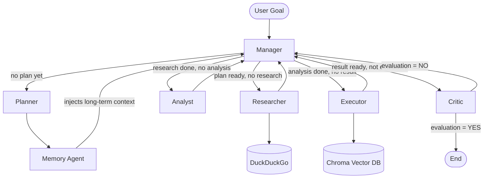
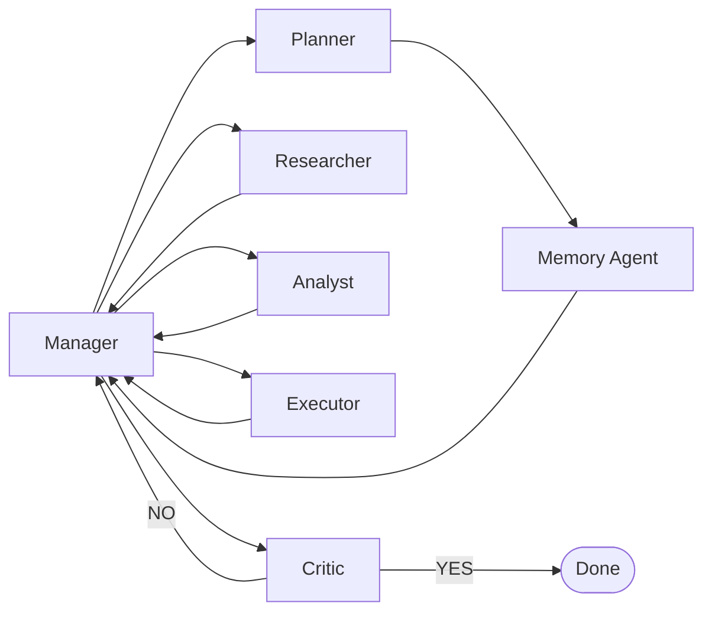
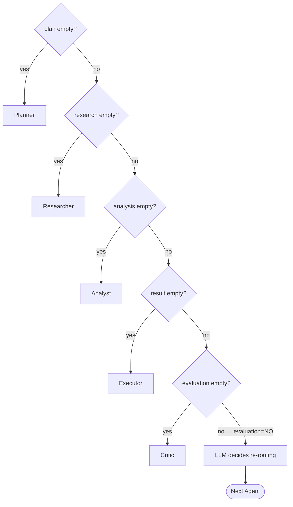
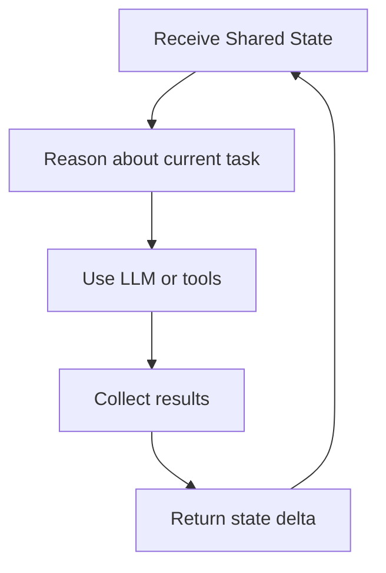
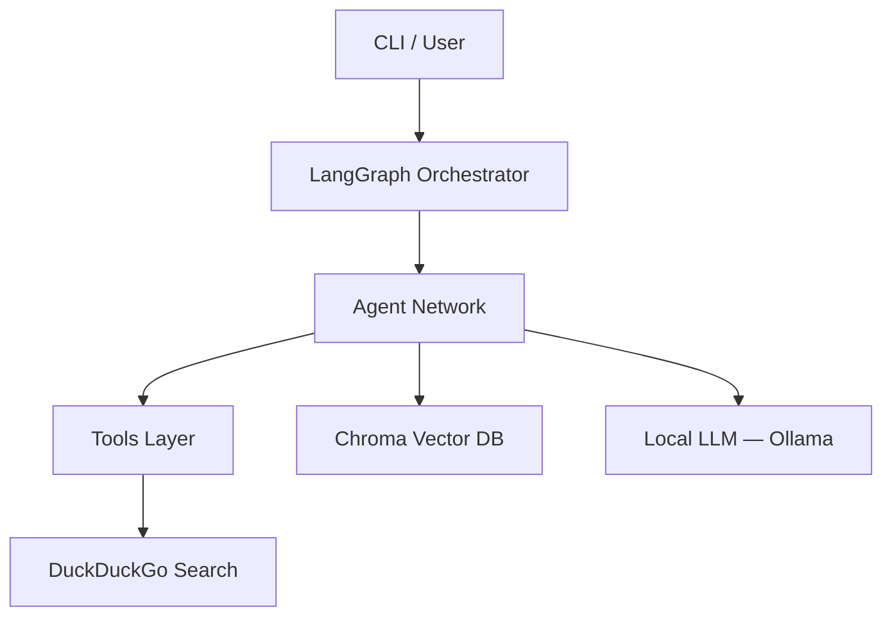

# Agent System Advanced — Distributed Multi-Agent System (Local LLM)

A local **multi-agent AI system** featuring recursive planning, task delegation, web search, and long-term memory, designed to run locally using a local LLM via Ollama.

This project demonstrates a modern **agentic architecture** using a properly structured Python package and has an educational goal.

---

## Features

- Multi-agent architecture (Manager / Planner / Memory Agent / Researcher / Analyst / Executor / Critic)
- Deterministic routing with LLM fallback
- Recursive task planning with iterative improvement
- Web search integration (DuckDuckGo)
- Long-term vector memory (Chroma + Ollama embeddings)
- Evaluation and refinement loops
- Fully local LLM via Ollama
- Clean Python package structure with `uv`
- CLI entrypoint

---

## Architecture Overview

The **Manager** is the central orchestrator. It decides which agent to call next using deterministic rules first, then falls back to the LLM for ambiguous states (e.g. after a negative evaluation).



---

## Agent Roles

| Agent | Role |
|---|---|
| **Manager** | Central router — decides which agent runs next using deterministic rules + LLM fallback |
| **Planner** | Decomposes the goal into ordered atomic tasks |
| **Memory Agent** | Enriches context by retrieving relevant long-term memories after planning |
| **Researcher** | Performs web searches for the current task and advances the plan |
| **Analyst** | Extracts key insights from research data |
| **Executor** | Produces the final result and stores it in long-term memory |
| **Critic** | Evaluates the result against the goal — triggers a new loop if unsatisfied |

---

## Agent Interaction Graph



---

## Manager Routing Logic

The Manager follows a strict priority order before calling the LLM:



---

## Internal Agent Loop

Each agent follows a standard reasoning cycle:



---

## Technical Stack



Core dependencies:

| Library | Role |
|---|---|
| **LangGraph** | Agent workflow orchestration |
| **LangChain** | LLM abstractions and tool interfaces |
| **Ollama** | Local LLM runtime |
| **Chroma** | Vector database for long-term memory |
| **DuckDuckGo (ddgs)** | Web search |
| **uv** | Python package and environment management |

---

## Project Structure

```
agent-system-advanced/
│
├── agent_system/
│   ├── __init__.py
│   ├── main.py               # CLI entrypoint (typer)
│   ├── graph.py              # LangGraph workflow definition
│   ├── state.py              # Shared AgentState (TypedDict)
│   │
│   ├── agents/
│   │   ├── manager.py        # Central router (deterministic + LLM fallback)
│   │   ├── planner.py        # Goal decomposition
│   │   ├── memory_agent.py   # Long-term memory retrieval
│   │   ├── researcher.py     # Web search + plan advancement
│   │   ├── analyst.py        # Insight extraction
│   │   ├── executor.py       # Final result generation + memory storage
│   │   └── critic.py         # Result evaluation
│   │
│   ├── memory/
│   │   └── vector_memory.py  # Chroma store/recall helpers
│   │
│   └── tools/
│       └── web_search.py     # DuckDuckGo wrapper
│
├── pyproject.toml
├── uv.lock
└── README.md
```

---

## Shared State

All agents read from and write to a single `AgentState` (TypedDict):

| Field | Type | Description |
|---|---|---|
| `goal` | `str` | The user's main objective |
| `plan` | `List[str]` | Ordered task list from the Planner |
| `current_task` | `Optional[str]` | Task currently being processed — `None` when the plan is exhausted |
| `research` | `str` | Raw data from web search |
| `analysis` | `str` | Insights extracted by the Analyst |
| `result` | `str` | Final output from the Executor |
| `context` | `str` | Compressed context from long-term memory |
| `retrieved_memory` | `str` | Raw recalled memory chunks |
| `evaluation` | `str` | `"YES"` or `"NO"` from the Critic |
| `selected_model` | `str` | Active Ollama model |
| `next_agent` | `str` | Routing decision from the Manager |
| `history` | `List[Dict]` | Append-only log of all agent actions |

---

## Requirements

- Python >= 3.12
- [Ollama](https://ollama.com) installed and running
- [uv](https://docs.astral.sh/uv/) package manager

---

## Installation

### 1. Install uv

```bash
curl -LsSf https://astral.sh/uv/install.sh | sh
```

### 2. Clone the repository

```bash
git clone https://github.com/AlexChariot/agent-system-advanced.git
cd agent-system-advanced
```

### 3. Install dependencies

```bash
uv sync
```

### 4. Install and start Ollama

```bash
# Install Ollama
curl -fsSL https://ollama.com/install.sh | sh

# Pull a model
ollama pull llama3.1

# Start the server
ollama serve
```

---

## Usage

### Run with a goal

```bash
uv run agent run "Analyze the impact of open-source LLMs"
```

### List available models

```bash
uv run agent models
```

### Switch model

```bash
uv run agent set-model mistral
```

### Show execution history

```bash
uv run agent show-history
```

### Clear execution history

```bash
uv run agent clear-history
```

> History and the active model are persisted between sessions in `~/.agent_system_history.json` and `~/.agent_system_model`.

---

## Example Workflow

```
User: "Analyze the impact of open-source LLMs"
  │
  ▼
Manager → Planner
  Planner generates tasks: ["Research open-source LLMs", "Analyze adoption trends", ...]
  │
  ▼
Memory Agent → retrieves related past results from Chroma
  │
  ▼
Manager → Researcher
  Researcher searches DuckDuckGo for the first task
  │
  ▼
Manager → Analyst
  Analyst extracts key insights from research
  │
  ▼
Manager → Executor
  Executor produces final result, stores it in Chroma
  │
  ▼
Manager → Critic
  Critic: "YES" → workflow ends
  Critic: "NO"  → Manager re-routes intelligently (LLM decision)
```

---

## Examples

### Research & Synthesis

```bash
# Thematic summary
uv run agent run "Summarize the latest advances in nuclear fusion"

# Technical comparison
uv run agent run "Compare Transformer and Mamba architectures for LLMs"

# Competitive landscape
uv run agent run "Analyze the differences between AWS, GCP, and Azure cloud offerings in 2025"
```

### Professional Use

```bash
# Interview preparation
uv run agent run "Prepare a list of technical interview questions for a senior MLOps engineer"

# Technical content writing
uv run agent run "Write a technical blog post about vector databases for a developer audience"

# Market analysis
uv run agent run "Analyze the LLM observability tooling market: players, trends, and gaps"
```

### Learning & Education

```bash
# Understanding a concept
uv run agent run "Explain how distributed consensus algorithms work (Raft, Paxos) with concrete examples"

# Learning roadmap
uv run agent run "Create a 4-week learning plan to master Kubernetes from scratch"

# Simplified explanation
uv run agent run "Explain backpropagation to someone who knows math but not machine learning"
```

### Development Assistance

```bash
# Architecture decisions
uv run agent run "What are the best practices for architecting a production-ready REST API with FastAPI?"

# Library comparison
uv run agent run "Compare LangGraph, CrewAI, and AutoGen for building a multi-agent system in Python"

# Conceptual debugging
uv run agent run "What are the common causes of memory leaks in Python and how do you detect them?"
```

### Analysis & Forecasting

```bash
# Technology impact
uv run agent run "Analyze the impact of open-source LLMs on the software industry in 2024-2025"

# Emerging trends
uv run agent run "What are the emerging trends in autonomous AI agents?"

# Geopolitical tech analysis
uv run agent run "Analyze the implications of the US-China rivalry on the semiconductor supply chain"
```

### Model Management

```bash
# Switch model based on task complexity
uv run agent set-model mistral        # fast, for simple tasks
uv run agent set-model llama3.1       # balanced (default)
uv run agent set-model deepseek-r1    # deep reasoning

# Check available local models (active model is marked)
uv run agent models

# Review past executions
uv run agent show-history

# Reset history
uv run agent clear-history
```

### Leveraging Long-Term Memory

Each result is stored in Chroma automatically. Subsequent runs on related topics
benefit from accumulated context without any manual intervention:

```bash
# Run 1 — builds the knowledge base
uv run agent run "Analyze the AI agent tooling market in Europe"

# Run 2 — memory agent retrieves the previous context automatically
uv run agent run "Which European AI agent startups are likely to raise funding in 2025?"

# Run 3 — benefits from both previous runs
uv run agent run "Write an investment report on European AI agents"
```

### Current Limitations

```bash
# ❌ Tasks requiring authenticated access
uv run agent run "Summarize my unread emails"  # no Gmail access

# ❌ File generation (code files, PDFs, images)
uv run agent run "Generate a Python script to scrape this website"  # produces text only

# ❌ Real-time data
uv run agent run "What is the current Bitcoin price?"  # DuckDuckGo results may be stale
```

---

## Development

### Verify the package imports correctly

```bash
uv run python -c "import agent_system"
```

### Lint

```bash
uv run ruff check .
```

### Format

```bash
uv run black .
```

---

## Troubleshooting

### `ModuleNotFoundError`

Ensure:
- `agent_system/__init__.py` exists
- All imports use absolute paths: `from agent_system.agents.planner import planner`
- Reinstall the environment: `uv sync --reinstall`

### Ollama not responding

Make sure the server is running before invoking the CLI:

```bash
ollama serve
```

### Chroma / embedding error

`vector_memory.py` uses lazy initialization — the vectorstore is only created on the first call to `store_memory()` or `recall_memory()`, not at import time. If you see an error here, make sure Ollama is running before invoking the CLI:

```bash
ollama serve
```

---

## Future Improvements

- Parallel research agents (multiple tasks simultaneously)
- Task hierarchy with decomposition trees
- Distributed agent execution via gRPC or message queues
- Agent bidding on tasks
- Model Context Protocol (MCP) integration
- Browser automation agent
- Tool discovery at runtime

---

## Educational Goal

This repository is a **learning platform for modern agent architectures**. It can be extended to build autonomous research agents, distributed AI systems, coding assistants, and intelligent automation pipelines.