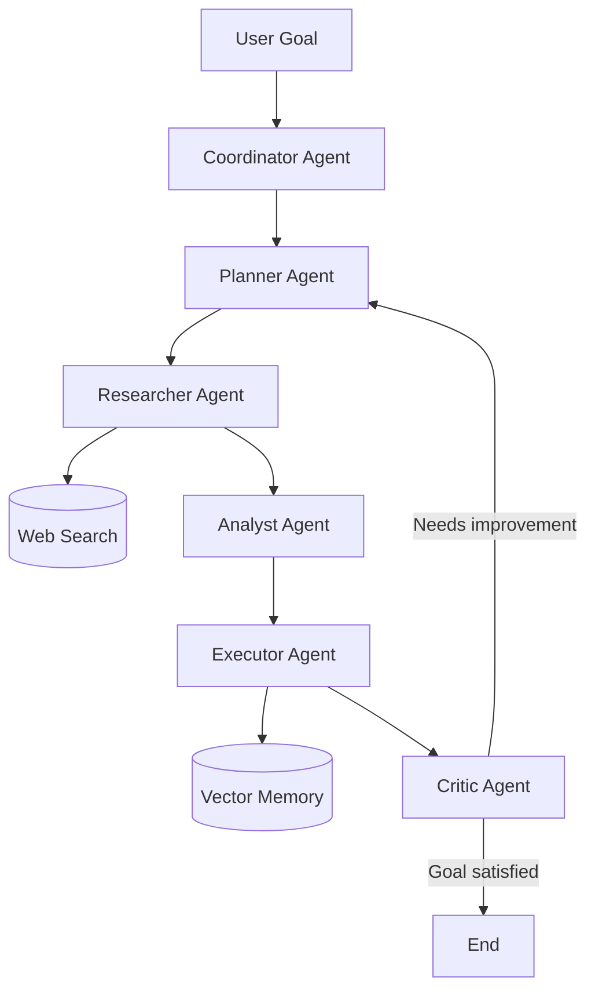
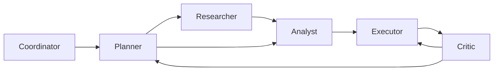
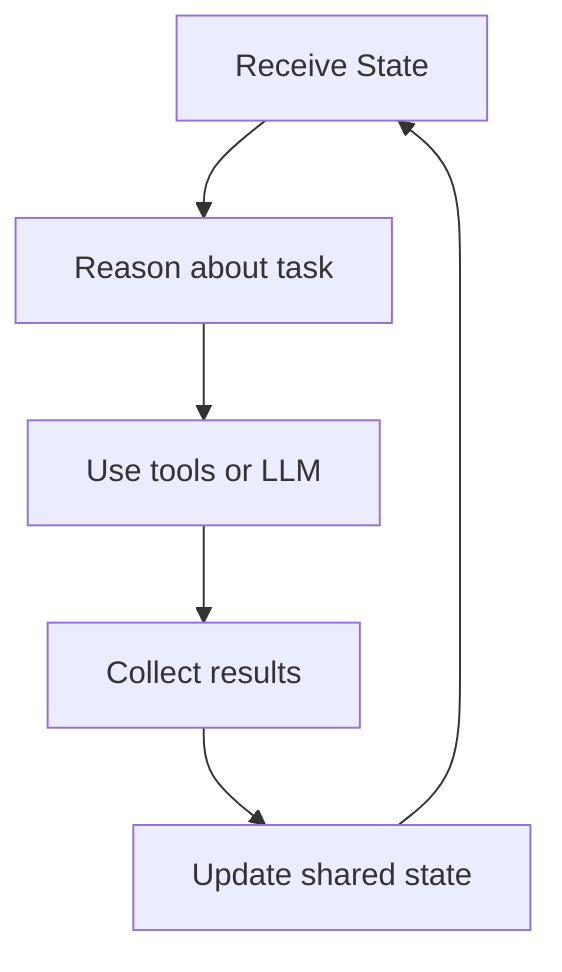
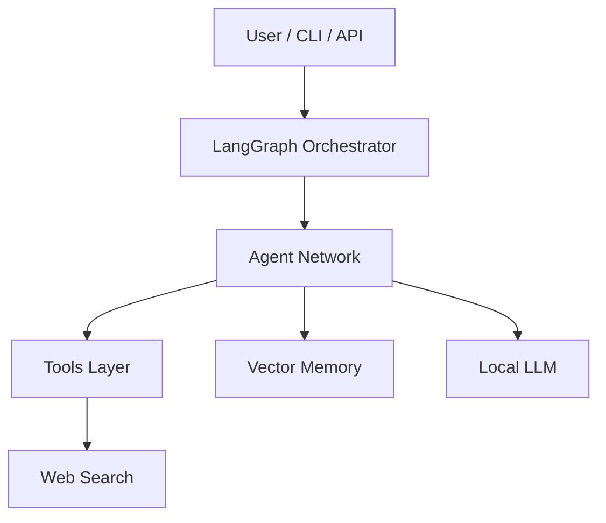

# Agent Society — Distributed Multi-Agent System (Local LLM)

A modular **multi-agent system** designed to run locally on a laptop using a local LLM.

This project demonstrates key ideas behind **modern agent architectures**:

* recursive task planning
* agent collaboration and delegation
* long-term vector memory
* web research tools
* evaluation and refinement loops
* extensible architecture for distributed agents

The goal is to provide a **clear and hackable reference implementation** for experimenting with multi-agent systems.

---

# Overview

The system organizes several specialized agents that collaborate to solve complex goals.

Each agent performs a focused role in the workflow and shares state with the others.

Agents implemented:

| Agent       | Role                                          |
| ----------- | --------------------------------------------- |
| Coordinator | routes tasks and selects next agent           |
| Planner     | decomposes goals into actionable tasks        |
| Researcher  | collects information from the web             |
| Analyst     | extracts insights from gathered data          |
| Executor    | produces the final output                     |
| Critic      | evaluates the result and triggers improvement |

---

# System Flow



---

# Agent Interaction Graph

This diagram shows **how agents communicate and delegate tasks**.



Key interaction patterns:

* Planner decomposes complex goals
* Researcher gathers data
* Analyst extracts meaning
* Executor generates final outputs
* Critic ensures quality and may restart planning

---

# Internal Agent Loop

Each agent follows a typical **reasoning cycle**.



This loop enables **iterative improvement and autonomy**.

---

# Technical Architecture

This diagram shows the system layers.



---

# Technology Stack

Core frameworks:

* LangGraph — agent workflow orchestration
* LangChain — tool abstractions and LLM interfaces

Local AI models:

* Ollama
* Llama3 (or any compatible model)

Tools:

* DuckDuckGo search
* Chroma vector database

Environment management:

* uv (fast Python package manager)

---

# Project Structure

```
agent-society
│
├── main.py
├── graph.py
├── state.py
│
├── agents/
│   ├── coordinator.py
│   ├── planner.py
│   ├── researcher.py
│   ├── analyst.py
│   ├── executor.py
│   └── critic.py
│
├── memory/
│   └── vector_memory.py
│
└── tools/
    └── web_search.py
```

Description:

main.py
Entry point of the application.

graph.py
Defines the multi-agent workflow.

state.py
Shared state passed between agents.

agents/
Contains each specialized agent.

memory/
Vector memory implementation.

tools/
External tools used by agents.

---

# Installation

## Install uv

```
curl -LsSf https://astral.sh/uv/install.sh | sh
```

## Install project dependencies

```
uv sync
```

---

# Install Local Model

Install Ollama:

```
curl -fsSL https://ollama.com/install.sh | sh
```

Download a model:

```
ollama pull llama3
```

Start the model server:

```
ollama serve
```

---

# Running the System

Run the multi-agent application:

```
uv run python main.py
```

Example usage:

```
Goal:
Analyze the impact of open-source LLMs
```

The system will automatically:

1. create a task plan
2. perform research
3. analyze collected data
4. produce a result
5. evaluate quality
6. iterate if needed

---

# Example Workflow

```
User Goal
   ↓
Planner creates tasks
   ↓
Researcher collects information
   ↓
Analyst extracts insights
   ↓
Executor produces output
   ↓
Critic evaluates result
   ↓
Loop if improvements needed
```

---

# Features

Current capabilities:

* multi-agent collaboration
* recursive planning
* self-evaluation loop
* web research
* long-term vector memory
* local LLM execution

---

# Future Improvements

Possible next steps:

Distributed agent execution

Agents running in separate processes or machines using:

* gRPC
* message queues
* Redis streams

Agent marketplaces

Agents dynamically bid on tasks.

Tool discovery

Integrate Model Context Protocol (MCP).

Agent-to-agent communication

Implement A2A protocols.

Parallel research agents

Multiple researchers working simultaneously.

Browser automation

Agents capable of browsing websites.

---

# Educational Goal

This repository is intended as a **learning platform for modern agent architectures**.

It can be extended to build:

* autonomous research agents
* distributed AI systems
* agent societies
* coding assistants
* intelligent automation platforms

---

# Inspiration

Architectures similar to this are being explored in modern agent research and industrial AI systems.

The concepts demonstrated here represent the foundation of **next-generation autonomous AI workflows**.
